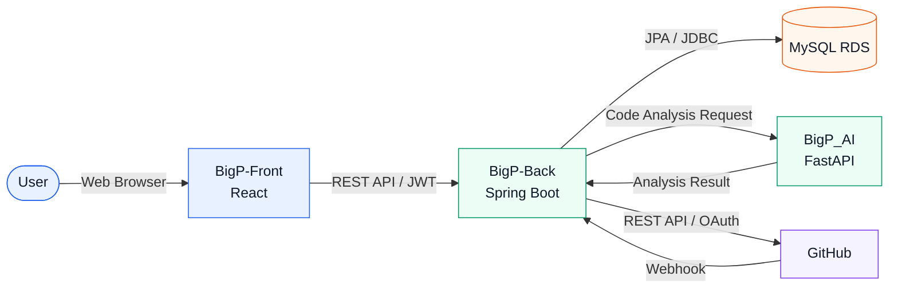

# GuardrAil Backend

GitHub 저장소의 코드를 AI로 분석하고, 개선 결과를 Push 및 Pull Request로 연결하는 GuardrAil 플랫폼의 Spring Boot 백엔드입니다.

## 주요 기능

- JWT 기반 회원가입, 로그인, 로그아웃 및 토큰 재발급
- 회원정보 조회·수정, 비밀번호 변경 및 회원 탈퇴
- GitHub OAuth 연동과 Access Token 암호화 저장
- GitHub 저장소, 브랜치, 파일 트리 및 Pull Request 조회
- AI 서버 코드 분석 요청과 분석 결과 저장
- 단일 파일 Push 및 Pull Request 생성
- 여러 분석 결과를 하나의 Commit으로 Push하고 하나의 Pull Request 생성
- 회사 단위 대시보드와 개인 MySpace 통계
- 공지사항, 첨부파일 및 알림 관리

## 시스템 구성



## 기술 스택

- Java 17
- Spring Boot 4.1
- Spring Web MVC
- Spring Data JPA
- Spring Security / OAuth2 Resource Server
- JWT
- MySQL 8
- Gradle
- Docker
- GitHub REST API

## 프로젝트 구조

```text
src/main/java/com/aivle/bigproject
├── ai/             # AI 분석 Controller, Service, DTO
├── config/         # Security, JWT, CORS 설정
├── controller/     # REST API Controller
├── dto/            # 요청·응답 DTO
├── entity/         # JPA Entity
├── exception/      # 공통 오류 코드와 예외 처리
├── repository/     # Spring Data JPA Repository
├── security/       # JWT 및 GitHub Token 보안
└── service/        # 비즈니스 로직
```

## 사전 준비

- JDK 17 이상
- 접근 가능한 MySQL 8 데이터베이스
- 실행 중인 BigP_AI 서버
- GitHub OAuth App
- Docker(선택)

## 환경변수 설정

프로젝트 루트에 `.env` 파일을 생성합니다. `bootRun` 실행 시 Gradle이 이 파일을 자동으로 읽습니다.

```dotenv
# Database
DB_URL=jdbc:mysql://DB_HOST:3306/guardrail?serverTimezone=Asia/Seoul&characterEncoding=UTF-8
DB_USERNAME=
DB_PASSWORD=

# Server
SERVER_PORT=8081
JPA_SHOW_SQL=false

# JWT
JWT_ISSUER=bigproject
JWT_SECRET=
JWT_ACCESS_TOKEN_EXPIRATION_SECONDS=3600
JWT_REFRESH_TOKEN_EXPIRATION_SECONDS=1209600

# GitHub OAuth / Webhook
GITHUB_CLIENT_ID=
GITHUB_CLIENT_SECRET=
GITHUB_OAUTH_REDIRECT_URI=http://localhost:8081/api/github/oauth/callback
GITHUB_WEBHOOK_SECRET=
GITHUB_WEBHOOK_CALLBACK_URL=
GITHUB_TOKEN_ENCRYPTION_KEY=

# Mail
MAIL_HOST=smtp.gmail.com
MAIL_PORT=587
MAIL_USERNAME=
MAIL_PASSWORD=

# External services
AI_BASE_URL=http://localhost:8000
FRONTEND_URL=http://localhost:5173
CORS_ALLOWED_ORIGIN=http://localhost:5173
```

개발용 Base64 키는 다음과 같이 생성할 수 있습니다.

```bash
openssl rand -base64 32 | tr -d '\n'
```

> `.env`, DB 비밀번호, JWT Secret, GitHub Secret 및 암호화 키는 Git에 커밋하지 않습니다.

## 로컬 실행

```bash
cd BigP-Back
./gradlew bootRun
```

서버 기본 주소는 `http://localhost:8081`입니다.

서버 상태 확인:

```bash
curl http://localhost:8081/api/health
```

DB 연결 확인:

```bash
curl http://localhost:8081/api/health/db
```

정상 응답:

```json
{"database":"UP"}
```

## 빌드 및 테스트

전체 테스트:

```bash
./gradlew test
```

빌드:

```bash
./gradlew clean build
```

실행 JAR 생성:

```bash
./gradlew bootJar
java -jar build/libs/bigproject-0.0.1-SNAPSHOT.jar
```

## Docker

일반 Linux/AWS용 이미지 생성:

```bash
docker buildx build \
  --platform linux/amd64 \
  -t bigp-back:latest \
  --load .
```

컨테이너 실행:

```bash
docker run -d \
  --name bigp-back \
  --env-file .env \
  -p 8081:8081 \
  bigp-back:latest
```

로그 확인:

```bash
docker logs -f bigp-back
```

컨테이너 종료 및 삭제:

```bash
docker stop bigp-back
docker rm bigp-back
```

## 인증

인증이 필요한 API는 다음 헤더를 사용합니다.

```http
Authorization: Bearer ACCESS_TOKEN
```

로그인 예시:

```bash
curl -X POST http://localhost:8081/api/users/login \
  -H 'Content-Type: application/json' \
  -d '{
    "loginId": "user@example.com",
    "password": "YOUR_PASSWORD"
  }'
```

## 주요 API

### 사용자

| Method | Endpoint | 설명 |
|---|---|---|
| POST | `/api/users/signup` | 회원가입 |
| POST | `/api/users/login` | 로그인 및 토큰 발급 |
| POST | `/api/users/refresh` | Access Token 재발급 |
| POST | `/api/users/logout` | 로그아웃 |
| GET | `/api/users/me` | 내 정보 조회 |
| PATCH | `/api/users/me` | 내 정보 수정 |
| PATCH | `/api/users/password` | 비밀번호 변경 |
| DELETE | `/api/users/me` | 회원 탈퇴 |

### GitHub 및 저장소

| Method | Endpoint | 설명 |
|---|---|---|
| GET | `/api/github/oauth/authorize-url` | GitHub OAuth 인증 URL 발급 |
| GET | `/api/repos` | 연결된 저장소 목록 조회 |
| GET | `/api/repos/{repoId}` | 연결 저장소 상세 조회 |
| GET | `/api/repos/{repoId}/branches` | 브랜치 목록 조회 |
| GET | `/api/repos/{repoId}/tree` | 저장소 파일 트리 조회 |
| GET | `/api/repos/{repoId}/pull-requests` | 저장소 Pull Request 조회 |
| GET | `/api/repos/{repoId}/history` | 저장소 분석 이력 조회 |

### 분석, Push 및 Pull Request

| Method | Endpoint | 설명 |
|---|---|---|
| POST | `/api/analysis` | 코드 분석 요청 |
| GET | `/api/analysis/{analysisId}` | 분석 결과 조회 |
| POST | `/api/analysis/{analysisId}/reanalyze` | 최신 GitHub 코드 재분석 |
| POST | `/api/analysis/{analysisId}/push` | 단일 분석 결과 Push |
| POST | `/api/analysis/{analysisId}/pr` | 단일 분석 Pull Request 생성 |
| POST | `/api/analysis/batch-push` | 여러 분석 결과를 하나의 Commit으로 Push |
| POST | `/api/analysis/batch-pull-request` | 다중 Push 결과로 Pull Request 생성 |

다중 Push는 같은 사용자, 저장소 및 브랜치에 속하고 아직 Push되지 않은 완료 분석만 처리합니다.

```text
분석 결과 선택
    → GitHub Blob 생성
    → Tree 생성
    → Commit 1개 생성
    → 브랜치 HEAD 갱신
    → Pull Request 생성
```

### 대시보드 및 MySpace

| Method | Endpoint | 설명 |
|---|---|---|
| GET | `/api/dashboard` | 회사 단위 대시보드 조회 |
| GET | `/api/my-space/overview` | 개인 MySpace 개요 조회 |
| GET | `/api/my-space/repos/{repoId}/summary` | 저장소·브랜치 요약 조회 |
| GET | `/api/my-space/repos/{repoId}/analyses` | 개인 분석 이력 조회 |
| GET | `/api/my-space/repos/{repoId}/pull-requests` | 개인 Pull Request 조회 |

### 공지사항 및 알림

| Method | Endpoint | 설명 |
|---|---|---|
| GET | `/api/notices` | 공지 목록 조회 |
| GET | `/api/notices/{noticeId}` | 공지 상세 조회 |
| POST | `/api/notices` | 공지 등록(관리자) |
| PATCH | `/api/notices/{noticeId}` | 공지 내용 수정(관리자) |
| DELETE | `/api/notices/{noticeId}` | 공지 삭제(관리자) |
| GET | `/api/notification` | 내 알림 조회 |
| PATCH | `/api/notification/{notificationId}/read` | 알림 읽음 처리 |
| DELETE | `/api/notification/{notificationId}` | 알림 삭제 |

## 주요 데이터베이스 테이블

| 테이블 | 역할 |
|---|---|
| `USER` | 사용자 및 GitHub 연동 정보 |
| `COMPANY` | 사용자 소속 기업 |
| `REFRESH_TOKEN` | Refresh Token 해시 |
| `GITHUB_REPO` | 연동된 GitHub 저장소 |
| `USER_REPO` | 사용자와 저장소 연결 |
| `ANALYSIS` | 코드 분석 요청과 Push 상태 |
| `FINDING` | 분석 결과와 개선 코드 |
| `GITHUB_PULL_REQUEST` | GitHub Pull Request 정보 |
| `PULL_REQUEST_ANALYSIS` | Pull Request와 분석 결과 연결 |
| `ANNOUNCEMENT` | 공지사항 |
| `ANNOUNCEMENT_FILE` | 공지 첨부파일 |
| `NOTIFICATION` | 사용자 알림 |

## 문제 해결

### 빌드는 성공하지만 서버가 종료되는 경우

- `DB_URL`, `DB_USERNAME`, `DB_PASSWORD` 확인
- `JWT_SECRET` 확인
- `GITHUB_TOKEN_ENCRYPTION_KEY`가 Base64 디코딩 기준 32바이트인지 확인
- 8081 포트가 이미 사용 중인지 확인

### 401 Unauthorized

- `Authorization: Bearer ...` 헤더 확인
- Access Token 만료 여부 확인
- 백엔드 재시작 전후 `JWT_SECRET`이 동일한지 확인

### GitHub Push 실패

- GitHub OAuth 쓰기 권한 확인
- 저장소와 브랜치가 존재하는지 확인
- 분석 이후 GitHub 파일 또는 브랜치가 변경됐는지 확인
- 보호 브랜치 및 Repository Ruleset 확인

### AI 서버 연결 실패

- `AI_BASE_URL` 확인
- BigP_AI 서버가 8000 포트에서 실행 중인지 확인

## 보안 주의사항

- 비밀번호는 단방향 해시로 저장합니다.
- GitHub Access Token은 암호화한 뒤 DB에 저장합니다.
- Refresh Token은 원문이 아닌 해시로 저장합니다.
- 운영 환경의 Secret은 `.env` 파일보다 AWS Secrets Manager 또는 Parameter Store 사용을 권장합니다.
- 노출된 Secret은 파일에서 삭제하는 것만으로 충분하지 않으며 즉시 폐기하고 재발급해야 합니다.
